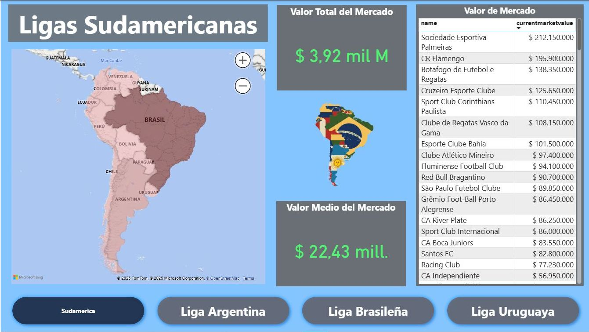
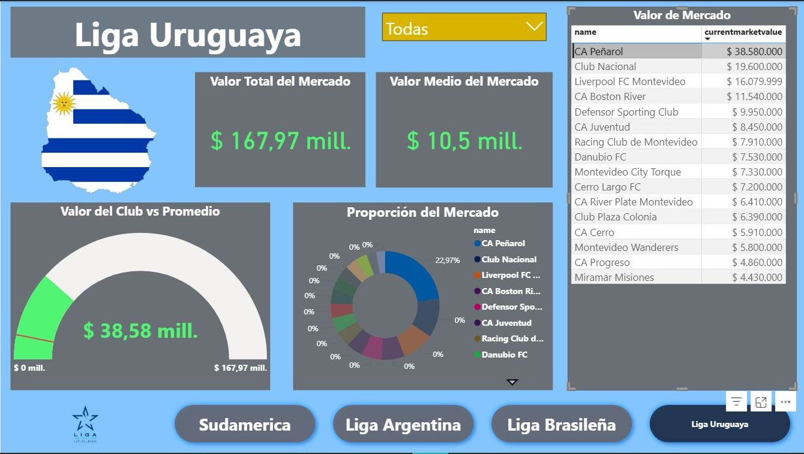
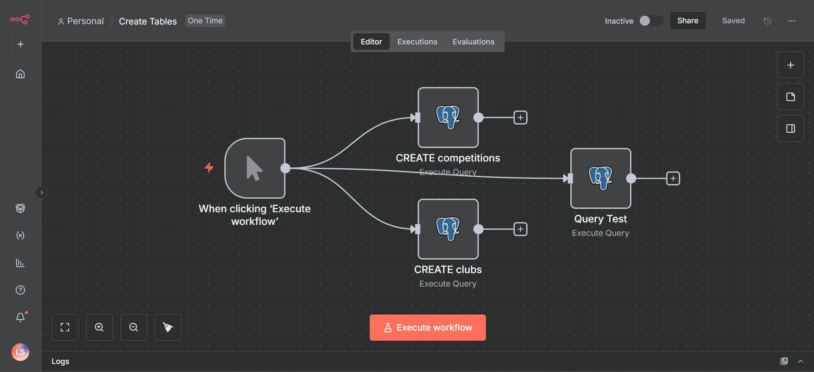
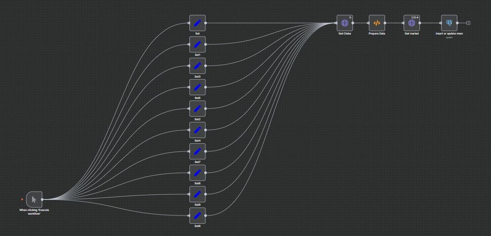

# Proyecto de Extracción y Visualización de Datos de Transfermarkt

Este proyecto demuestra un flujo de trabajo completo para la extracción, almacenamiento y visualización de datos de fútbol del sitio web Transfermarkt.

## Descripción General

El objetivo de este proyecto es proporcionar una solución integral para:

1.  **Extracción de Datos**: Utiliza una API personalizada desarrollada en FastAPI para extraer datos de Transfermarkt de manera automatizada.
2.  **Ingesta de Datos**: Emplea flujos de trabajo de n8n para procesar y cargar los datos extraídos en una base de datos PostgreSQL.
3.  **Visualización de Datos**: Conecta Power BI a la base de datos PostgreSQL para crear dashboards interactivos y visualizaciones dinámicas.

## Arquitectura

El proyecto se compone de los siguientes elementos:

*   **API de Transfermarkt**: Una API RESTful construida con FastAPI que expone endpoints para obtener datos de clubes, jugadores y competiciones de Transfermarkt. Esta api esta basada en el respositorio de [felipeall](https://github.com/felipeall/transfermarkt-api)
*   **n8n**: Una herramienta de automatización de flujos de trabajo que orquesta el proceso de extracción e ingesta de datos. Los flujos de n8n se encargan de:
    *   Llamar a la API de Transfermarkt para obtener los datos.
    *   Transformar y limpiar los datos según sea necesario.
    *   Insertar los datos en las tablas correspondientes de la base de datos PostgreSQL.
*   **PostgreSQL**: Una base de datos relacional que almacena los datos extraídos de Transfermarkt.
*   **Power BI**: Una herramienta de inteligencia de negocios que se conecta a la base de datos PostgreSQL para visualizar los datos a través de informes y dashboards interactivos.

## Flujo de Trabajo

1.  **Inicio del Proceso**: El flujo de trabajo se inicia manualmente o de forma programada en n8n.
2.  **Extracción**: El flujo de n8n realiza una serie de llamadas a la API de Transfermarkt para recopilar la información deseada.
3.  **Procesamiento**: Los datos recibidos de la API se procesan y transforman en n8n para adaptarlos al esquema de la base de datos.
4.  **Carga**: Los datos transformados se cargan en la base de datos PostgreSQL.
5.  **Visualización**: Los usuarios pueden acceder a los dashboards de Power BI, que se actualizan automáticamente con los nuevos datos de la base de datos, para explorar y analizar la información.

## Cómo Empezar

Para replicar este proyecto, necesitarás tener conocimientos de:

*   Python y FastAPI para la API.
*   n8n para la automatización de flujos de trabajo.
*   SQL y PostgreSQL para la base de datos.
*   Power BI para la visualización de datos.

Puedes encontrar los detalles de configuración y los archivos necesarios en este repositorio.
